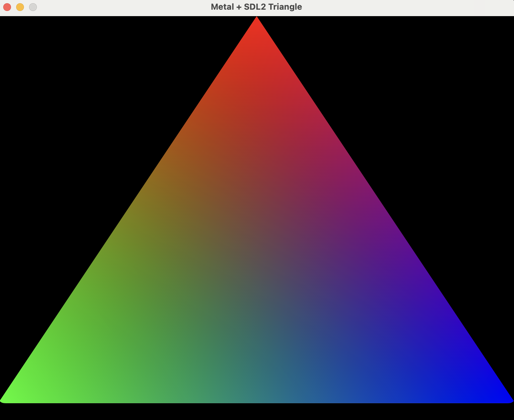

# Metal Triangle

This is a simple example of how to:
- Use Metal to render a triangle using SDL2 and [Metal-cpp](https://github.com/Metal-cpp/Metal-cpp).
- Compile Metal shaders using CMake during the build process.

## Install dependencies

    brew install sdl2 cmake

## Build and Run

    cmake -Bbuild
    cmake --build build
    ./build/metal_triangle

